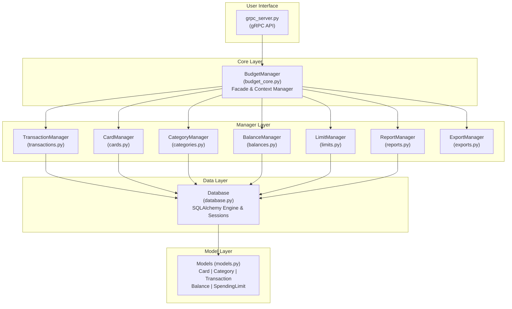
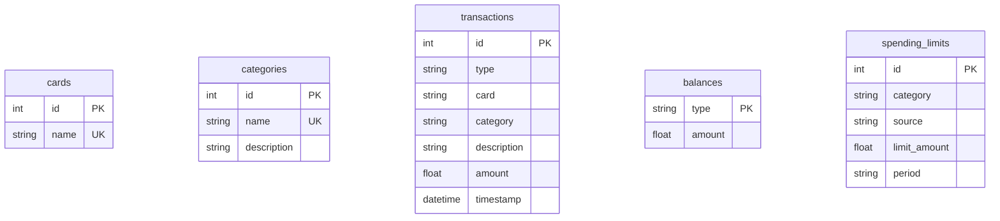

# Budget Tracker

A modular personal budget tracking application with a gRPC API for managing daily transactions, account balances, spending limits, and financial analytics.

## Features

- **Transaction Management**: Track income and expenses with detailed categorization
- **Card Management**: Support for multiple payment cards
- **Category System**: Organize transactions with custom categories
- **Balance Tracking**: Monitor multiple account balances
- **Spending Limits**: Set and track spending limits by category, period, or source
- **Reports & Analytics**: View spending breakdowns by category, daily trends, and balance analysis
- **Data Export**: Export transactions to CSV or JSON formats
- **gRPC API**: Remote API for transaction management and budget viewing

## Installation

### Prerequisites
- Python >= 3.13
- [uv](https://docs.astral.sh/uv/) package manager

### Quick Start
```bash
# Install dependencies
uv sync

# Start the gRPC server
python start_grpc_server.py
```

### Installation Options

**Development installation:**
```bash
uv pip install -e ".[dev]"
```

**Standard installation:**
```bash
uv pip install -e .
```

## Usage

### Starting the gRPC Server

```bash
# Start server on default port (50051)
python start_grpc_server.py

# Start server on custom port
python start_grpc_server.py --port 8080

# Or use the installed script
budget-grpc-server

# Using just
just grpc-server
just grpc-server 8080
```

### Testing the gRPC API

```bash
# Run example client
python example_grpc_client.py

# Connect to custom host/port
python example_grpc_client.py --host localhost --port 8080

# Using just
just grpc-client
just grpc-client localhost 8080
```

### Available gRPC Services

**TransactionService:**
- `AddTransaction` - Create a new transaction
- `UpdateTransaction` - Update an existing transaction
- `DeleteTransaction` - Delete a transaction by ID
- `GetTransaction` - Retrieve a single transaction
- `GetRecentTransactions` - Get recent transactions with limit
- `SearchTransactions` - Search with filters (query, category, card, date range, amount range)

**BudgetService:**
- `GetAllBalances` - Retrieve all account balances
- `GetBalance` - Get balance for a specific account
- `UpdateBalance` - Update an account balance
- `GetCategories` - List all categories
- `AddCategory` - Create a new category
- `GetSpendingByCategory` - Get spending breakdown by category for a month
- `GetDailySpending` - Get daily spending for the last N days
- `GetSpendingLimits` - List all spending limits
- `SetSpendingLimit` - Set a new spending limit
- `CheckSpendingLimit` - Check if a limit is exceeded

### Using the gRPC API in Your Code

```python
import grpc
from budget.proto import budget_pb2, budget_pb2_grpc

# Connect to server
channel = grpc.insecure_channel('localhost:50051')
txn_stub = budget_pb2_grpc.TransactionServiceStub(channel)
budget_stub = budget_pb2_grpc.BudgetServiceStub(channel)

# Add a transaction
response = txn_stub.AddTransaction(
    budget_pb2.AddTransactionRequest(
        type="card",
        card="Visa",
        description="Coffee",
        amount=5.50,
        category="Food"
    )
)

# Get all balances
response = budget_stub.GetAllBalances(
    budget_pb2.GetAllBalancesRequest()
)
for balance in response.balances:
    print(f"{balance.type}: ${balance.amount}")

# Search transactions
response = txn_stub.SearchTransactions(
    budget_pb2.SearchTransactionsRequest(
        category="Food",
        start_date="2024-01-01",
        end_date="2024-12-31"
    )
)
for txn in response.transactions:
    print(f"{txn.description}: ${txn.amount}")

# Set spending limit
response = budget_stub.SetSpendingLimit(
    budget_pb2.SetSpendingLimitRequest(
        limit_amount=500.0,
        period="monthly",
        category="Food"
    )
)

# Check spending limit
response = budget_stub.CheckSpendingLimit(
    budget_pb2.CheckSpendingLimitRequest(
        category="Food",
        period="monthly"
    )
)
print(f"Spent: ${response.result.current_spending}")
print(f"Limit: ${response.result.limit_amount}")
print(f"Exceeded: {response.result.is_exceeded}")
```

### Regenerating Proto Files

If you modify `budget/proto/budget.proto`, regenerate the Python code:

```bash
# Using just
just grpc-compile

# Or manually
python -m grpc_tools.protoc \
  -Ibudget/proto \
  --python_out=budget/proto \
  --grpc_python_out=budget/proto \
  budget/proto/budget.proto
```

## Code Architecture

### Overview
The application follows a modular manager-based architecture with clear separation of concerns. Each functional domain is handled by a dedicated manager class that operates on SQLAlchemy ORM models.

### Architecture Diagram



### Core Components

#### 1. BudgetManager (`budget_core.py`)
- **Role**: Main facade and context manager
- **Responsibilities**:
  - Database initialization and session management
  - Delegation to specialized managers
  - Context manager protocol (`__enter__`, `__exit__`)
  - Transaction commit/rollback handling

#### 2. Manager Classes

**TransactionManager** (`transactions.py`)
- Add, update, delete transactions
- Search and filter transactions
- Retrieve recent transactions

**CardManager** (`cards.py`)
- Manage payment cards
- Load and store card information

**CategoryManager** (`categories.py`)
- Create and manage transaction categories
- Category descriptions

**BalanceManager** (`balances.py`)
- Track multiple balance types
- Update and query balances

**LimitManager** (`limits.py`)
- Set spending limits by category/source/period
- Check limit violations
- Retrieve all limits

**ReportManager** (`reports.py`)
- Daily spending trends
- Category spending breakdowns
- Balance percentage analysis

**ExportManager** (`exports.py`)
- Export to CSV format
- Export to JSON format
- Date range filtering

#### 3. Data Layer

**Database** (`database.py`)
- SQLAlchemy engine creation
- Database initialization
- Connection management

**Models** (`models.py`)
- `Card`: Payment card entities
- `Category`: Transaction categories
- `Transaction`: Financial transactions
- `Balance`: Account balances
- `SpendingLimit`: Spending limit rules
- `DictAccessMixin`: Dict-like access to model attributes

#### 4. User Interface

**gRPC API** (`grpc_server.py`)
- Remote procedure call interface
- TransactionService and BudgetService
- Protocol buffer-based communication
- Concurrent request handling

#### 5. Error Handling (`exceptions.py`)
- `BudgetError`: Base exception
- `DatabaseError`: Database-specific errors
- `ValidationError`: Input validation errors

### Design Patterns

1. **Facade Pattern**: `BudgetManager` provides a unified interface to all subsystems
2. **Context Manager**: Automatic session and transaction management
3. **Delegation**: Core manager delegates to specialized managers
4. **Repository Pattern**: Managers encapsulate data access logic
5. **ORM Pattern**: SQLAlchemy models map to database tables

### Data Flow

1. Client sends gRPC request to server
2. gRPC server calls `BudgetManager` methods
3. `BudgetManager` delegates to appropriate manager
4. Manager performs operations via SQLAlchemy session
5. Changes committed/rolled back on context exit
6. Results returned to gRPC client

### Database Schema



## Testing

Run tests with coverage:
```bash
pytest
```

**Test coverage includes:**
- Core manager functionality (`test_budget_core.py`)
- Transaction operations (`test_transactions.py`)
- Category management (`test_categories.py`)
- Balance tracking (`test_balances.py`)
- Spending limits (`test_limits.py`)
- Reporting functionality (`test_reports.py`)
- Export operations (`test_exports.py`)
- Data models (`test_models.py`)

**Coverage reports:**
- Terminal output with missing line numbers
- HTML report in `htmlcov/` directory

**Run specific tests:**
```bash
# Test a specific file
pytest tests/test_budget_core.py

# Test a specific function
pytest tests/test_transactions.py::test_add_transaction

# Run with verbose output
pytest -v

# Show print statements
pytest -s
```

## Development

### Project Structure
```
budget/
├── __init__.py           # Package initialization
├── budget_core.py        # Core BudgetManager facade
├── grpc_server.py        # gRPC API server
├── proto/                # Protocol buffer definitions
│   ├── __init__.py
│   ├── budget.proto      # gRPC service definitions
│   ├── budget_pb2.py     # Generated proto messages (auto-generated)
│   └── budget_pb2_grpc.py # Generated gRPC stubs (auto-generated)
├── transactions.py       # Transaction manager
├── cards.py              # Card manager
├── categories.py         # Category manager
├── balances.py           # Balance manager
├── limits.py             # Spending limit manager
├── reports.py            # Report manager
├── exports.py            # Export manager
├── database.py           # Database setup
├── models.py             # SQLAlchemy models
└── exceptions.py         # Custom exceptions

tests/
├── conftest.py           # Pytest configuration
├── test_*.py             # Test modules
└── __init__.py

start_grpc_server.py      # gRPC server startup script
example_grpc_client.py    # Example gRPC client
pyproject.toml            # Project configuration
Justfile                  # Development task runner
```

### Dependencies

**Core:**
- **sqlalchemy** (>=2.0.0): ORM and database toolkit
- **grpcio** (>=1.60.0): gRPC runtime
- **grpcio-tools** (>=1.60.0): Protocol buffer compiler and code generation
- **protobuf** (>=4.25.0): Protocol buffer runtime

**Development:**
- **pytest** (>=8.0.0): Testing framework
- **pytest-cov** (>=4.1.0): Coverage reporting
- **pytest-mock** (>=3.12.0): Mocking utilities

### Environment Variables
- `BUDGET_DB_NAME`: Override default database name (default: `budget.db`)

### Build and Development Tools

The project uses a `Justfile` for common development tasks. If you have [just](https://github.com/casey/just) installed:

```bash
# Run tests
just test

# Start gRPC server (default port 50051)
just grpc-server

# Start gRPC server on custom port
just grpc-server 8080

# Run example gRPC client
just grpc-client

# Connect client to custom server
just grpc-client localhost 8080

# Recompile proto files
just grpc-compile

# Clean build artifacts
just clean

# Lint code
just lint
```

## Example Workflow

```python
import grpc
from budget.proto import budget_pb2, budget_pb2_grpc

# Connect to server
channel = grpc.insecure_channel('localhost:50051')
txn_stub = budget_pb2_grpc.TransactionServiceStub(channel)
budget_stub = budget_pb2_grpc.BudgetServiceStub(channel)

# First time setup - add categories
budget_stub.AddCategory(
    budget_pb2.AddCategoryRequest(
        name="Food & Drink",
        description="Meals and beverages"
    )
)

budget_stub.AddCategory(
    budget_pb2.AddCategoryRequest(
        name="Transport",
        description="Travel and commuting"
    )
)

# Update balance
budget_stub.UpdateBalance(
    budget_pb2.UpdateBalanceRequest(
        balance_type="cash",
        amount=100.0
    )
)

# Add some transactions
txn_stub.AddTransaction(
    budget_pb2.AddTransactionRequest(
        type="cash",
        description="Lunch at cafe",
        amount=12.50,
        category="Food & Drink"
    )
)

txn_stub.AddTransaction(
    budget_pb2.AddTransactionRequest(
        type="card",
        card="Visa",
        description="Train ticket",
        amount=8.20,
        category="Transport"
    )
)

# Set monthly limits
budget_stub.SetSpendingLimit(
    budget_pb2.SetSpendingLimitRequest(
        limit_amount=200.0,
        period="monthly",
        category="Food & Drink"
    )
)

budget_stub.SetSpendingLimit(
    budget_pb2.SetSpendingLimitRequest(
        limit_amount=100.0,
        period="monthly",
        category="Transport"
    )
)

# Check spending
response = budget_stub.GetSpendingByCategory(
    budget_pb2.GetSpendingByCategoryRequest(
        year=2024,
        month=10
    )
)
for spending in response.category_spending:
    print(f"{spending.category}: ${spending.amount} ({spending.percentage:.1f}%)")

# Check limits
limits_response = budget_stub.GetSpendingLimits(
    budget_pb2.GetSpendingLimitsRequest()
)
for limit in limits_response.limits:
    print(f"{limit.category}: ${limit.limit_amount} ({limit.period})")
```

## Database

The application uses SQLite for data storage. The database file (`budget.db` by default) is created automatically in the current working directory on first run. All transactions, balances, categories, cards, and limits are persisted in this file.

**Database location:**
- Default: `./budget.db`
- Custom: Set via `BUDGET_DB_NAME` environment variable

**Schema:** See the Database Schema section in the architecture documentation above.

## Troubleshooting

**Database locked errors:**
- Ensure only one instance of the application is running
- Close any database browser tools that might have the file open

**Missing dependencies:**
- Run `uv sync` to ensure all dependencies are installed

**gRPC connection refused:**
- Ensure the gRPC server is running on the expected port
- Check firewall settings if connecting from a remote machine

**Proto file changes not reflected:**
- Run `just grpc-compile` to regenerate the Python proto files
- Restart both server and client after regenerating

## Contributing

Contributions are welcome! Please ensure:
1. All tests pass (`pytest`)
2. Code follows the existing style
3. New features include tests
4. Documentation is updated
5. Proto files are recompiled if modified

## License

MIT License
