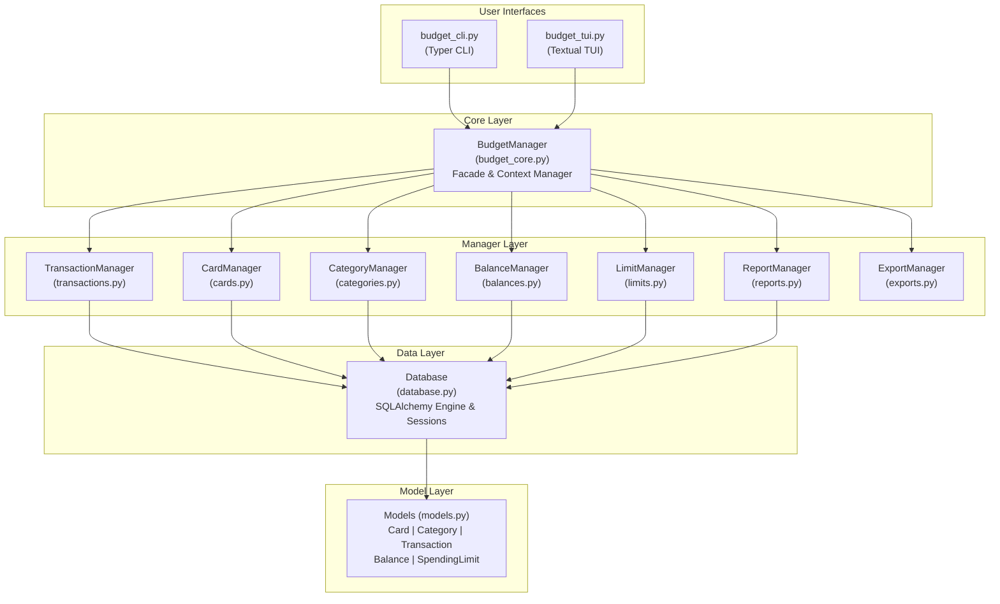
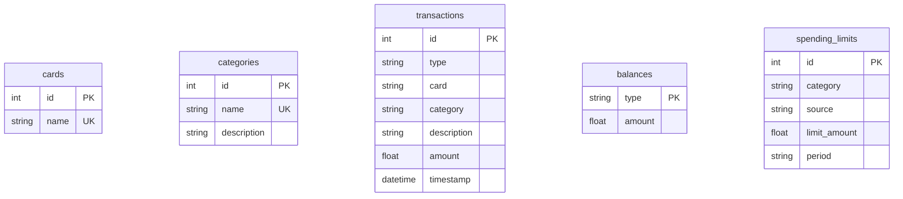

# Budget Tracker

A modular personal budget tracking application with both CLI and TUI interfaces for managing daily transactions, account balances, spending limits, and financial analytics.

## Features

- **Transaction Management**: Track income and expenses with detailed categorization
- **Card Management**: Support for multiple payment cards
- **Category System**: Organize transactions with custom categories
- **Balance Tracking**: Monitor multiple account balances
- **Spending Limits**: Set and track spending limits by category, period, or source
- **Reports & Analytics**: View spending breakdowns by category, daily trends, and balance analysis
- **Data Export**: Export transactions to CSV or JSON formats
- **Dual Interface**: Both CLI (command-line) and TUI (text-based UI) interfaces

## Installation

### Prerequisites
- Python >= 3.13
- [uv](https://docs.astral.sh/uv/) package manager

### Install from source
```bash
uv pip install -e .
```

### Install with development dependencies
```bash
uv pip install -e ".[dev]"
```

### Sync dependencies
```bash
uv sync
```

## Usage

### CLI Mode
```bash
budget [command] [options]
```

### TUI Mode
Launch the interactive text-based UI:
```bash
budget tui
```

## Code Architecture

### Overview
The application follows a modular manager-based architecture with clear separation of concerns. Each functional domain is handled by a dedicated manager class that operates on SQLAlchemy ORM models.

### Architecture Diagram



### Core Components

#### 1. BudgetManager (`budget_core.py`)
- **Role**: Main facade and context manager
- **Responsibilities**:
  - Database initialization and session management
  - Delegation to specialized managers
  - Context manager protocol (`__enter__`, `__exit__`)
  - Transaction commit/rollback handling

#### 2. Manager Classes

**TransactionManager** (`transactions.py`)
- Add, update, delete transactions
- Search and filter transactions
- Retrieve recent transactions

**CardManager** (`cards.py`)
- Manage payment cards
- Load and store card information

**CategoryManager** (`categories.py`)
- Create and manage transaction categories
- Category descriptions

**BalanceManager** (`balances.py`)
- Track multiple balance types
- Update and query balances

**LimitManager** (`limits.py`)
- Set spending limits by category/source/period
- Check limit violations
- Retrieve all limits

**ReportManager** (`reports.py`)
- Daily spending trends
- Category spending breakdowns
- Balance percentage analysis

**ExportManager** (`exports.py`)
- Export to CSV format
- Export to JSON format
- Date range filtering

#### 3. Data Layer

**Database** (`database.py`)
- SQLAlchemy engine creation
- Database initialization
- Connection management

**Models** (`models.py`)
- `Card`: Payment card entities
- `Category`: Transaction categories
- `Transaction`: Financial transactions
- `Balance`: Account balances
- `SpendingLimit`: Spending limit rules
- `DictAccessMixin`: Dict-like access to model attributes

#### 4. User Interfaces

**CLI** (`budget_cli.py`)
- Typer-based command-line interface
- Command structure for all operations
- Rich console output

**TUI** (`budget_tui.py`)
- Textual-based interactive UI
- Real-time updates
- Visual dashboards and forms

#### 5. Error Handling (`exceptions.py`)
- `BudgetError`: Base exception
- `DatabaseError`: Database-specific errors
- `ValidationError`: Input validation errors

### Design Patterns

1. **Facade Pattern**: `BudgetManager` provides a unified interface to all subsystems
2. **Context Manager**: Automatic session and transaction management
3. **Delegation**: Core manager delegates to specialized managers
4. **Repository Pattern**: Managers encapsulate data access logic
5. **ORM Pattern**: SQLAlchemy models map to database tables

### Data Flow

1. User interacts via CLI or TUI
2. Interface calls `BudgetManager` methods
3. `BudgetManager` delegates to appropriate manager
4. Manager performs operations via SQLAlchemy session
5. Changes committed/rolled back on context exit
6. Results returned to user interface

### Database Schema



## Testing

Run tests with coverage:
```bash
pytest
```

Test files are organized by component:
- `test_budget_core.py`: Core manager tests
- `test_transactions.py`: Transaction operations
- `test_categories.py`: Category management
- `test_cards.py`: Card management (if exists)
- `test_balances.py`: Balance tracking
- `test_limits.py`: Spending limits
- `test_reports.py`: Reporting functionality
- `test_exports.py`: Export operations
- `test_models.py`: Data model tests

## Development

### Project Structure
```
budget/
├── __init__.py           # Package initialization
├── budget_core.py        # Core BudgetManager facade
├── budget_cli.py         # CLI interface (Typer)
├── budget_tui.py         # TUI interface (Textual)
├── transactions.py       # Transaction manager
├── cards.py              # Card manager
├── categories.py         # Category manager
├── balances.py           # Balance manager
├── limits.py             # Spending limit manager
├── reports.py            # Report manager
├── exports.py            # Export manager
├── database.py           # Database setup
├── models.py             # SQLAlchemy models
└── exceptions.py         # Custom exceptions

tests/
├── conftest.py           # Pytest configuration
├── test_*.py             # Test modules
└── __init__.py

pyproject.toml            # Project configuration
```

### Dependencies
- **typer**: CLI framework
- **rich**: Terminal formatting
- **textual**: TUI framework
- **sqlalchemy**: ORM and database toolkit

### Environment Variables
- `BUDGET_DB_NAME`: Override default database name (default: `budget.db`)

## License

[Add your license here]

## Contributing

[Add contributing guidelines here]
